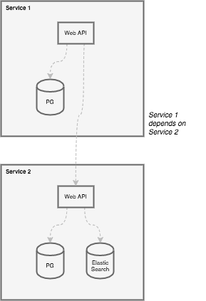
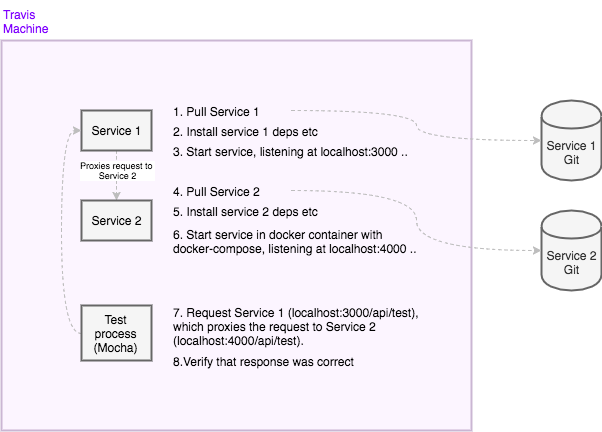

# Travis Example, Service 1

In this example, we have a distributed system with two services: Service 1
and Service 2. Each service consists of a web api and possible data stores.
Services are dockerized so that launching the service, and its internal stores
is relatively easy with `docker-compose up`.

This is the architecture of our example system. Service 1 depends on Service 2.

We're trying to achieve tests where simply:

1. The whole system is launched inside Travis CI
2. We make requests to Service 1 (which behind the scenes requests Service 2)
3. Assert that responses were satisfying

This is what we would want to happen inside Travis:

